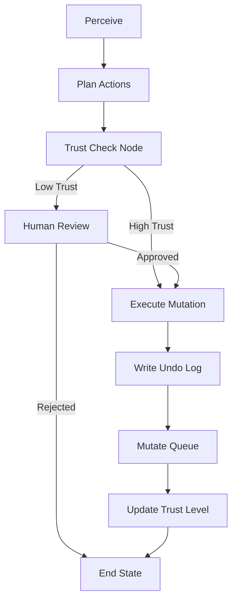

# Architecture Overview

This project embodies a stateful AI agent managing a content queue using LangGraph. It is designed around the core principle of minimizing the agent's destructive potential through progressive autonomy and reversible actions.

## Execution Flow Workflow

1. **Perceive Queue**: The agent begins by using `perceive_node` to grab the current exact state of the local `content_queue`. 
2. **Plan Actions**: With the context, `plan_node` evaluates user instructions via LLM and proposes a set of actions using Pydantic Validation via LangChain's `bind_tools`.
3. **Trust Gate**: The actions list is then validated by `check_trust_node` against an SQLite `trust_metrics` tracker. If **any** operation in a batch has less than `N` successful executions, the batch goes to Human Review.
4. **Human Review**: Uses `interrupt()` to await human feedback ("Y"/"N").
5. **Execution**: If authorized by `check_trust` (or properly reviewed), `execute_node` intercepts Python SQLite functions and forces a transactional write into an append-only `action_log` containing the pre-mutation exact JSON values.
6. **Apply Mutation**: The mutation hits `content_queue` exclusively *after* logging the `action_log`. The `trust_metrics` counter increments by 1 if successful.

## Diagram

